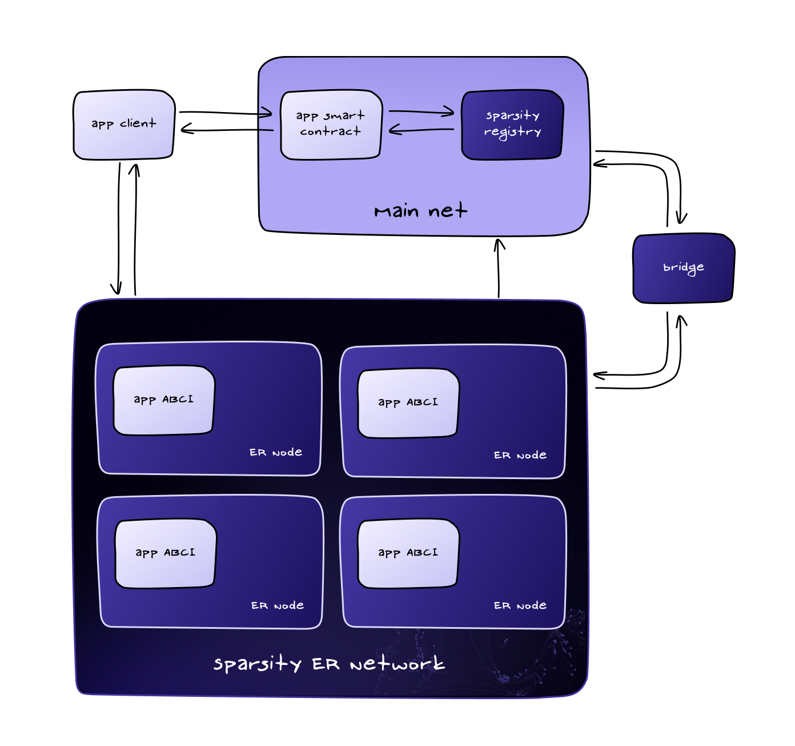

# System Architecture

## **Understanding the Sparsity System**

Sparsity is built on two core components: the **Mainnet** and the **Sparsity Network**.

* The **Mainnet** serves as the primary blockchain where applications operate.
* The **Sparsity Network** manages ephemeral roll-ups for off-chain computation.

Currently, Sparsity supports most **EVM-compatible chains** (such as Base, Ethereum, and BNB Smart Chain) and will integrate non-EVM blockchains like **Solana** in the future.

This architecture connects three key participants:

* **App Users** – Interact with decentralized applications.
* **App Developers/Owners** – Build and deploy applications.
* **Computing Resource Providers** – Offer computational power for roll-up execution.

### **Integrating an App with Sparsity** (For Developers)

To integrate an application with Sparsity, the app developer/owner must:

1️⃣ **Deploy the App Smart Contract** – The smart contract must be deployed on the Mainnet.\
2️⃣ **Register the Smart Contract & ABCI Core** – Register the app’s smart contract and **public Docker-based ABCI core** with the Sparsity contract on the Mainnet.\
3️⃣ **Publish the App Client (Optional)** – If the app requires a user-facing interface, the developer may choose to publish an app client.\
4️⃣ **Bridge Between Mainnet & Sparsity Network (Optional)** – Sparsity provides a built-in bridge, eliminating the need for custom implementations.

### **Computing Resource Providers Workflow**

1️⃣ **Register Resources** – Computing providers register their **IP/domain/URL** with the Sparsity Network.

### **How an App User Interacts with the App**

1️⃣ **User Interaction** – The user interacts with the app’s smart contract on the Mainnet.\
2️⃣ **Triggering Sparsity Contract** – The smart contract invokes the **Sparsity contract** on the Mainnet.\
3️⃣ **Resource Allocation** – The **Sparsity bridge** assigns computing resources and deploys the ephemeral roll-up within the Sparsity Network.\
4️⃣ **Writing Back to Mainnet** – The **Sparsity bridge** writes roll-up machine details back to the app’s smart contract on the Mainnet.\
5️⃣ **Roll-Up Interaction** – The user interacts with the ephemeral roll-up via the app client and smart contract.\
6️⃣ **Final Settlement** – Intermediate states and final computation results are written back to the Mainnet through the **Sparsity bridge**.

With Sparsity, developers can **effortlessly scale** their dApps, leveraging **decentralized infrastructure and high-performance computation** to create the next generation of Web3 applications! 🚀

<figure><figcaption></figcaption></figure>
